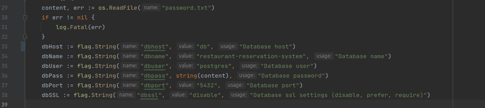

# restaurant-reservation-system

> Restaurant reservation system for booking table in different restaurants <br>

### Tools
```
golang
postgresql - db
gorm - orm
gin - framework
swagger - documentation
jwt - token
```

### Installation
git clone https://github.com/nanmenkaimak/restaurant-reservation-system <br>
configure database  
change values given variables in ``main.go`` file <br>
for running project
```
go run ./cmd/main
```
OR <br>
create docker-compose.yaml file by looking at docker-compose.yaml.example, fill missing values<br>
then for running by docker compose write
```
docker-compose up --build restaurant-reservation-system
```

### Testing 
There is ``postman.json`` file where all postman request you can do. Just import this json to your postman collections
    
